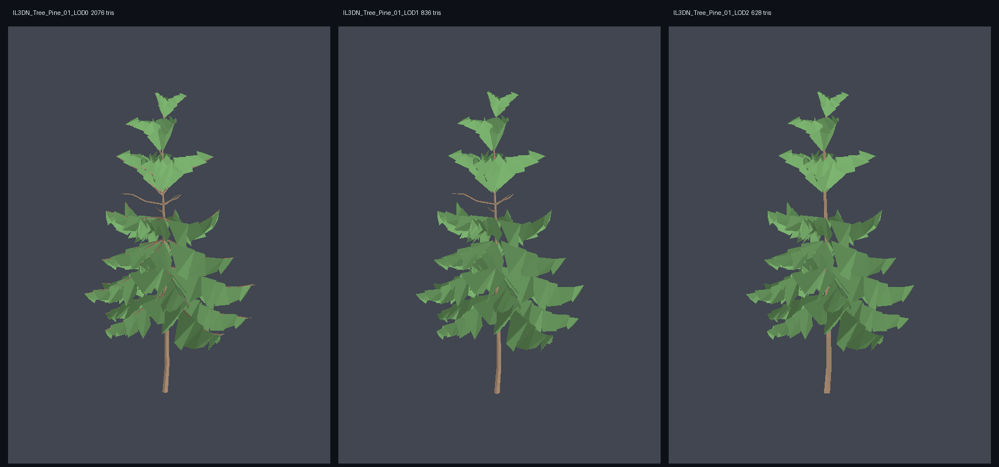
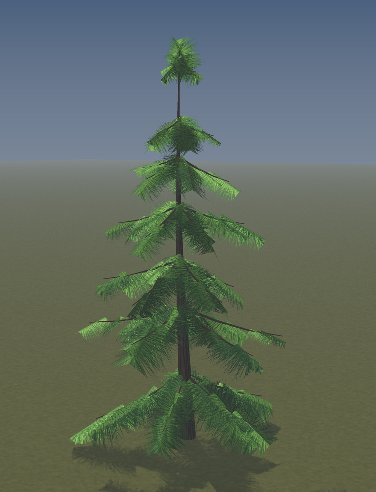
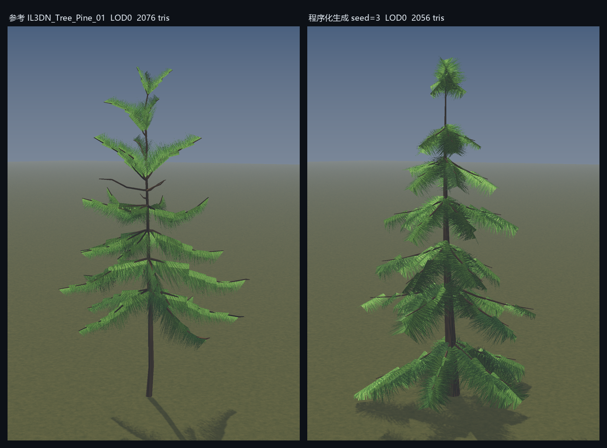
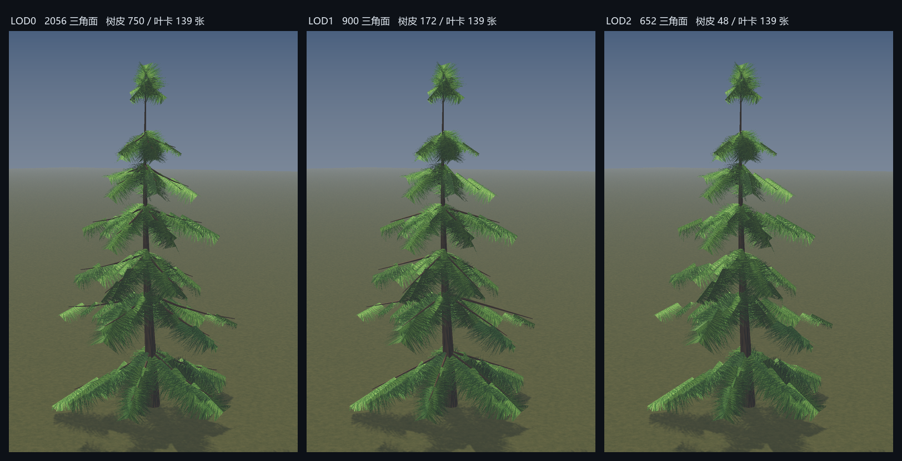
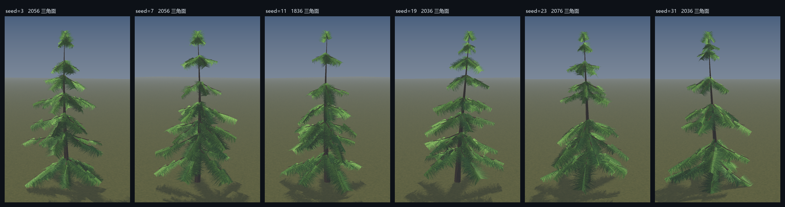
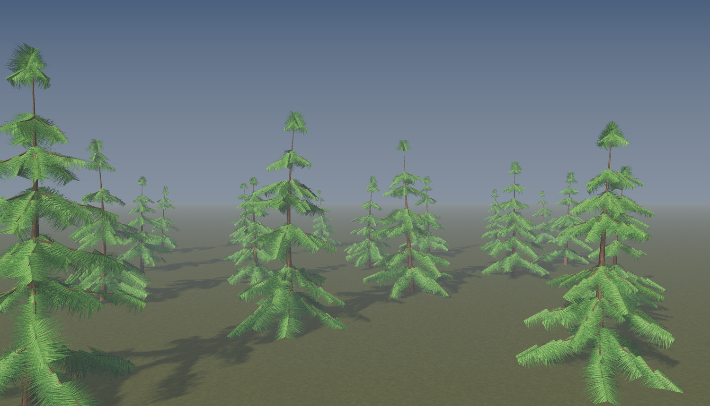
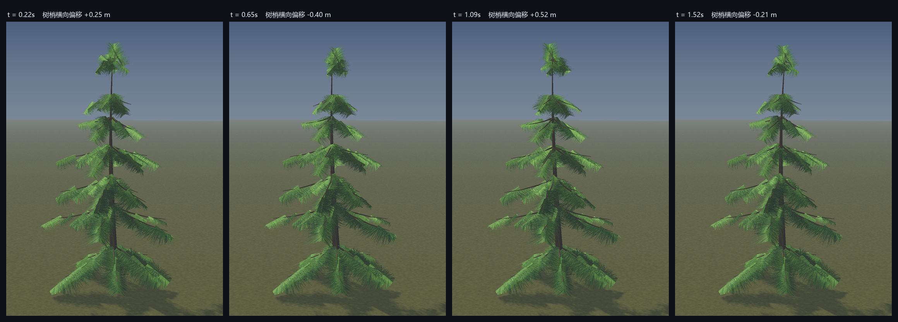

# 自动化生成低模针叶树的可行性调研

> **命题**：能不能自动化生成 `mesh/IL3DN_Tree_Pine_01_OneMesh.FBX` 这类树模型？不要求一模一样，形似即可。
>
> **结论**：可以，而且不需要任何 DCC 软件。本次调研已经把完整流水线跑通并落地到 `tools/` 下，产物通过了第三方 FBX 加载器的独立校验。
>
> **要动手做新品类，看 [程序化植被生成手册](程序化植被生成手册.md)。** 这份报告只讲"为什么选这条路线"，手册讲"怎么做"。

---

## 1. 先把参考模型拆开看

自动化的前提是搞清楚"这种树"到底是什么。用自己写的 FBX 解析器（`tools/inspect_fbx.py`、`tools/analyze_tree_fbx.py`、`tools/analyze_layout.py`）把参考资产完全逆向出来，结果如下。

### 1.1 资产规格

| 项目 | 实测值 |
|---|---|
| 来源 | 3ds Max 2019 导出，FBX 7300 二进制；原始路径显示来自 Unity 资产包 IL3DN |
| 尺寸 | 高 4.94 m，冠幅 2.87 m |
| LOD | 一个 FBX 内嵌 3 个 mesh，命名 `_LOD0/_LOD1/_LOD2`，挂在一个 Null 根节点下 |
| 面数 | LOD0 2076 / LOD1 836 / LOD2 628 三角面 |
| 拓扑 | **全四边形**，无三角面、无 n-gon |
| 材质 | 2 个槽：`Default_Bark` + `Default_Leaves`（Phong，无贴图，贴图在 Unity 侧指定） |
| UV | 单通道 `UVChannel_1` |
| 顶点色 | RGBA 四分量，承载风动画数据 |

### 1.2 三个关键设计（这是"能不能自动化"的真正答案所在）

**（1）LOD 只简化树干，叶片一动不动。**

| | LOD0 | LOD1 | LOD2 |
|---|---|---|---|
| 树皮四边形 | 772 | 152 | **48** |
| 叶片四边形 | 266 | 266 | 266 |

叶片数在三级 LOD 中完全恒定，减面全部发生在树干与枝条上。LOD2 的 48 = 6 边 × 8 段，就是一根光秃的锥形管。这解释了为什么三个 LOD 渲染出来几乎看不出区别 —— 针叶树的轮廓由叶片决定，树干本来就被挡住了。

**（2）叶片不是平面卡片，是 V 形对折的双四边形。**

133 个连通分量，每个恰好 6 顶点 / 2 四边形。结构是：一条脊线（2 个顶点）+ 两侧各 2 个翼点，两个四边形共享脊边折成 V 形。实测厚长比 0.56，也就是折得很开。这是用 2 个面做出体积感的经典技巧 —— 无论从哪个角度看都有轮廓，不会像平面卡片那样侧看变成一条线。

UV 上，一张卡沿 U 方向跨 0→2，即贴图平铺两次，两个翼各占一格。整棵树的叶片只用了 16 个唯一 UV 点。

**（3）顶点色是风动画数据，不是颜色。**

| 通道 | 树皮 | 叶片 | 语义 |
|---|---|---|---|
| R | 恒 0 | 恒 0 | 未使用 |
| G | 恒 0 | 0~1 随机 | 每张叶卡的抖动相位 |
| B | 恒 0 | 恒 0 | 未使用 |
| **A** | 与高度相关系数 **+0.988** | **+0.993** | 归一化高度 = 整体弯曲权重 |

Alpha 就是 `z / 树高`，根部 0、梢部 1，在着色器里直接当风位移的乘数。这是社区常见做法，但**不是任何官方标准**（SpeedTree 走 UV2/UV3，Unreal Pivot Painter 走贴图，CryEngine 的 RGB 语义又和 SpeedTree 几乎相反）。既然是自己生成资产配自己的 shader，只要生成器和 shader 约定一致即可。

### 1.3 骨架布局规律

- **7 层轮生枝**，位于树高 22% ~ 99%，层间距平均 0.60 m
- 每层 5 根枝，共 **35 根**（树皮网格恰好是 1 个主干 + 35 个独立管状分量）
- 每层叶卡数从下到上：25 / 25 / 20 / 20 / 19 / 12 / 12 = 133
- 树冠包络近似线性：`Rmax ≈ 1.73 − 1.29 × (z/H)`
- 叶卡长轴倾角中位 41°（下垂）

**这套结构的规则程度是决定性的。**针叶树是所有树种里骨架最规整的：一根近乎笔直的主干 + 逐层轮生的侧枝 + 锥形包络。没有阔叶树那种由光照竞争塑造的复杂冠层。这意味着不需要 L-system、不需要空间殖民算法，几行"沿主干每隔 h 生成一轮 n 根侧枝，长度随高度线性衰减"就能表达，而且能精确控制面数。

参考模型三级 LOD 渲染：



---

## 2. 技术路线调研

### 2.1 现成工具都不合适

| 路线 | 判断 | 原因 |
|---|---|---|
| **Blender Sapling Tree Gen** | 不推荐 | 4.2 起已移出内置、改为社区维护扩展；多份用户反馈称 5.x 下无法运行。叶片只支持单四边形/六边形，无顶点色、无 LOD 概念 |
| **Modular Tree (MTree)** | 可借鉴 | 有活跃 fork、支持 Weber-Penn 锥形包络，核心库 MIT 授权。但风数据走 Unreal Pivot Painter 贴图路线，不是顶点色 |
| **The Grove** | 不推荐 | 生长模拟质量最好，但 Python 自动化导出锁在 €799 档，且只出 USD/OBJ 不出 FBX |
| **TreeIt** | 仅作对标 | 唯一免费且能一次吐 5 级 LOD 的工具，但纯 GUI 无命令行、无法批量；FBX 是 ASCII；LOD 策略不可控 |
| **Arbaro / ngPlant** | 不推荐 | 事实停止维护（Arbaro 最后更新 2015），输出 OBJ/DXF/POV-Ray，都表达不了顶点色 |
| **EZ-Tree** | 不合适 | Three.js 生态，官方说明其网格未针对实时优化，动辄数万面，无 LOD 无顶点色 |
| **AI 生成（Trellis / Hunyuan3D / Tripo / Meshy）** | **结构性不可行** | 见下 |

### 2.2 AI 直接生成为什么不行

这不是质量问题，是结构问题。这些模型从体素/隐式场提取**单一连续的实心表面**，物理上产不出"133 个互不相连的悬浮 V 形卡片"这种拓扑 —— 那不是一个"物体"，那是一套资产约定。同样也产不出多材质槽、LOD 链，更不可能实现"叶片恒定只减树干"的选择性简化。顶点色对它们而言是颜色，不是归一化高度权重。

学术界的最新工作反而印证了正确的分工：2026 年的 FloraForge 是**让 LLM 生成程序化 Python 脚本**，TU Wien 的 TreesFormer 是**让 Transformer 预测 L-system 语法**。都不是让神经网络直接吐网格。也就是说，AI 在这个任务里的正确用法是帮你写生成器，而不是替你生成模型。

### 2.3 采用的路线：纯 Python 程序化生成 + 自写 FBX 写出器

一开始的计划是"生成几何 + headless Blender 导出 FBX"，但本机环境卡住了：没装 Blender，且 Python 是 3.12 —— `pip install bpy` 当前只有绑定 Python 3.13 的 5.x 和绑定 3.11 的 4.x，3.12 没有匹配版本。

于是改走**完全零依赖**路线：把 FBX 二进制格式也自己实现。这反而是更强的可行性证明 —— 整条链路只需要 numpy。

FBX 7300 二进制格式并不复杂，主要是三部分：23 字节魔数头 + 版本号、递归的节点记录（每条含 end offset / 属性数 / 属性区长度 / 名字 / 属性 / 子节点 / 13 字节哨兵）、以及一个包含 footer id、16 字节对齐填充、版本号、120 个零字节和固定魔数的文件尾。节点树结构直接照参考文件抄，兼容性最有保障。

---

## 3. 落地的流水线

```
PineParams (28 个参数 + seed)
   ↓  pine_gen.py         纯 numpy 几何构造
   ├── 主干：锥形管，平行传输避免扭结，边数/段数按 LOD 变化
   ├── 枝条：轮生排布 + 黄金角错位，锥形包络约束冠幅，末端上翘
   ├── 叶卡：V 形对折双四边形，UV 沿 U 跨 0→2
   └── 顶点色：A = z/H，叶片 G = 每卡随机相位
   ↓  fbx_writer.py       自写二进制 FBX 7300
   Null 根 + <Base>_LOD0/1/2 + 2 材质槽 + RGBA 顶点色
   ↓  build_pine.py       回读校验（自写解析器）
   ↓  validate_with_ufbx.py   第三方加载器独立校验
```

### 3.1 文件清单

| 文件 | 作用 |
|---|---|
| `tools/inspect_fbx.py` | 最小 FBX 二进制解析器 |
| `tools/analyze_tree_fbx.py` | 拓扑 / UV / 顶点色语义分析 |
| `tools/analyze_layout.py` | 轮生层、树冠包络、叶卡形状提取 |
| `tools/pine_gen.py` | **程序化松树生成器** |
| `tools/fbx_writer.py` | **二进制 FBX 写出器** |
| `tools/build_pine.py` | 端到端流水线 + 自动断言 |
| `tools/validate_with_ufbx.py` | 第三方加载器独立校验 |
| `tools/softrender.py` | numpy z-buffer 软件渲染器（平面着色，快速预览） |
| `tools/render_hq.py` | **带贴图 / 阴影 / 抗锯齿的软件渲染器** |
| `tools/gen_tree_textures.py` | 程序化生成针叶、树皮、地面贴图 |
| `tools/render_scenes.py` | 出图脚本（主图 / 对比 / LOD / 变体 / 树林 / 风动画） |
| `tools/tune_pine.py` / `showcase.py` | 参数网格调优 / 展示图 |

### 3.2 生成结果



面数对齐情况：

| | 参考 LOD0 | 生成 LOD0 | 参考 LOD1 | 生成 LOD1 | 参考 LOD2 | 生成 LOD2 |
|---|---|---|---|---|---|---|
| 三角面 | 2076 | 2056 | 836 | 900 | 628 | 652 |
| 树皮四边形 | 772 | 750 | 152 | 172 | **48** | **48** |
| 叶片四边形 | 266 | 278 | 266 | 278 | 266 | 278 |

**与参考的同条件对比。**两边面数相当（2076 vs 2056），套同一张针叶贴图、同一组光照参数。之所以能直接套同一张贴图，是因为参考资产的叶卡 UV 布局（脊线在 v=0、翼展到 v=1、U 跨 0→2 平铺两次）已经被生成器精确复现：



形态上，参考（左）下部裸干更长、树冠更稀疏，生成的（右）更饱满。这是 `crown_base`、`whorl_count`、`card_len` 几个参数的取值差异，不是结构性差异。

LOD 链行为与参考一致 —— 轮廓几乎不变，减面全在树干：



同一套参数只换 seed：



18 棵树摆成小树林，全部由同一个生成器一次跑出：



**顶点色风数据是真能驱动动画的。**下面几帧是直接读顶点色做的形变：位移量 = `A² × 振幅`（A 是归一化高度，所以根部不动、梢部摆幅最大），每张叶卡再叠加一个以 G 通道为相位的高频抖动。完整循环见 `exports/hq_wind.mp4`。



### 3.3 校验结果

产物用 **ufbx**（与本项目完全无关的第三方 FBX 加载器，被多个引擎采用）独立读取：

```
FBX 版本 7300  ASCII=False
>>> 解析警告数: 0
单位: 1 单位 = 0.01 米
坐标轴: up=POSITIVE_Y front=POSITIVE_Z right=POSITIVE_X
节点 5  网格 3  材质 2
层级:
  - ProcPine_03  [NULL]
    - ProcPine_03_LOD0  [MESH]
    - ProcPine_03_LOD1  [MESH]
    - ProcPine_03_LOD2  [MESH]

[ProcPine_03_LOD0]
  顶点 1800  面 1028（四边形 1028）  三角面 2056
  各材质槽面数: [750, 278]
  顶点色 value_reals=4（4 = RGBA，Alpha 保留）
  Alpha 与高度 Y 的相关系数 = +1.0000
```

要点：**零警告**；全四边形；顶点色是四分量 RGBA，Alpha 通道完整保留；Alpha 与高度相关系数 +1.0000（参考模型是 +0.988，因为它的梯度不是严格线性）；层级是 Null 根 + `_LOD0/1/2`，正是 Unity 自动创建 LODGroup 的命名约定。

> 附带发现：ufbx 的 Python 绑定在访问 `node.parent` 和 `mesh.instances[i]` 时会段错误。**参考资产在完全相同的位置崩溃**，所以是绑定库缺陷，与被检文件无关。校验脚本已绕开这些访问器。

### 3.4 吞吐

单线程连续生成 100 棵完整的树（每棵含 3 个 LOD 并写出 FBX）：

```
总耗时 15.6s  ->  156 ms/棵  (6.4 棵/秒)
LOD0 平均 1966 tris   FBX 总体积 18.0 MB
```

纯 Python 未做任何优化。按官方推荐用 `multiprocessing` 铺开，一台普通机器每分钟出几千棵树没有问题。

---

## 4. 还缺什么

诚实地说，现在做完的是**几何生成**这一环。要变成能直接投产的资产管线，还缺三块：

1. **贴图还没进 FBX。** 参考资产的 FBX 里本来就没有贴图，材质只是占位的 Phong 色块，真正的树皮/针叶图集是在 Unity 侧挂上去的，生成器现在同样只写材质槽和 UV。渲染用的针叶 / 树皮 / 地面贴图已经程序化生成了（`tools/gen_tree_textures.py`），而且用同一张针叶图渲染参考资产也完全贴合，说明 UV 布局是对齐的。剩下的只是在 FBX 里补 `Texture` / `Video` 节点做正式关联，或者按参考资产的做法留给引擎侧挂。

2. **引擎侧闭环验证。** 本机没有 Blender 也没有 Unity，所以"ufbx 能干净读取"是目前能拿到的最强证据。真正导进 Unity 确认 LODGroup 自动生成、顶点色 Alpha 数值没被 gamma 污染，这一步必须实机做一次。特别注意导出时的 sRGB / Linear 选择 —— Alpha 存的是数值而不是颜色，走 sRGB 会引入 gamma 变换污染数据。

3. **树种扩展。** 现在的生成器是针对针叶树的轮生结构写死的。要做阔叶树，骨架部分得换成递归分枝或空间殖民算法（论文都公开，实现约百行），但叶卡生成、顶点色编码、LOD 分档、FBX 写出这几块可以完全复用。

---

## 5. 结论

**能自动化，而且比预期简单。**

判断的依据不是"有现成工具"—— 恰恰相反，调研下来**没有任何现成工具能直接产出这个规格**（V 形叶卡 + Alpha 存归一化高度 + 三级 LOD 只减树干 + 全四边形）。这些是一套非常具体的资产契约，通用树生成器要么不支持要么不可控。

真正的依据是：**这类资产的复杂度被严重高估了**。参考模型总共 2076 个三角面，几何上只有两个原语 —— 一根锥形管和一张对折卡片，都是几十行数学。而看起来最脏的活（顶点色 RGBA、多材质槽、LOD 命名分组、FBX 二进制序列化）也都是一次性成本，写完就不用再碰。

用现成树生成器反而是本末倒置：你会花更多时间逆向改造它的输出去满足这些硬约束，而不是直接生成。而这些约束在生成时是**免费的**（你就这么建），在事后改造时是**昂贵的**（要重拓扑）。

一句话：**这不是一个建模问题，是一个写 300 行几何代码的问题。**

---

## 附：复现方式

```bash
# 逆向分析参考资产
python tools/analyze_tree_fbx.py mesh/IL3DN_Tree_Pine_01_OneMesh.FBX
python tools/analyze_layout.py

# 生成 + 导出 FBX + 自动校验（可给多个 seed）
python tools/build_pine.py 3 7 11 19

# 第三方加载器独立校验
python tools/validate_with_ufbx.py exports/ProcPine_03.fbx

# 出展示图 + 吞吐测试
python tools/showcase.py

# 生成贴图，再出带贴图 / 阴影的高质量渲染
python tools/gen_tree_textures.py
python tools/render_scenes.py all
# 也可以只出其中一张：hero / compare / lods / variants / forest / wind
```

依赖：`numpy`、`pillow`（出图用）、`ufbx`（仅校验用，可选）、`imageio` + `imageio-ffmpeg`（仅风动画用，可选）。不需要 Blender、不需要 FBX SDK、不需要 GPU。
